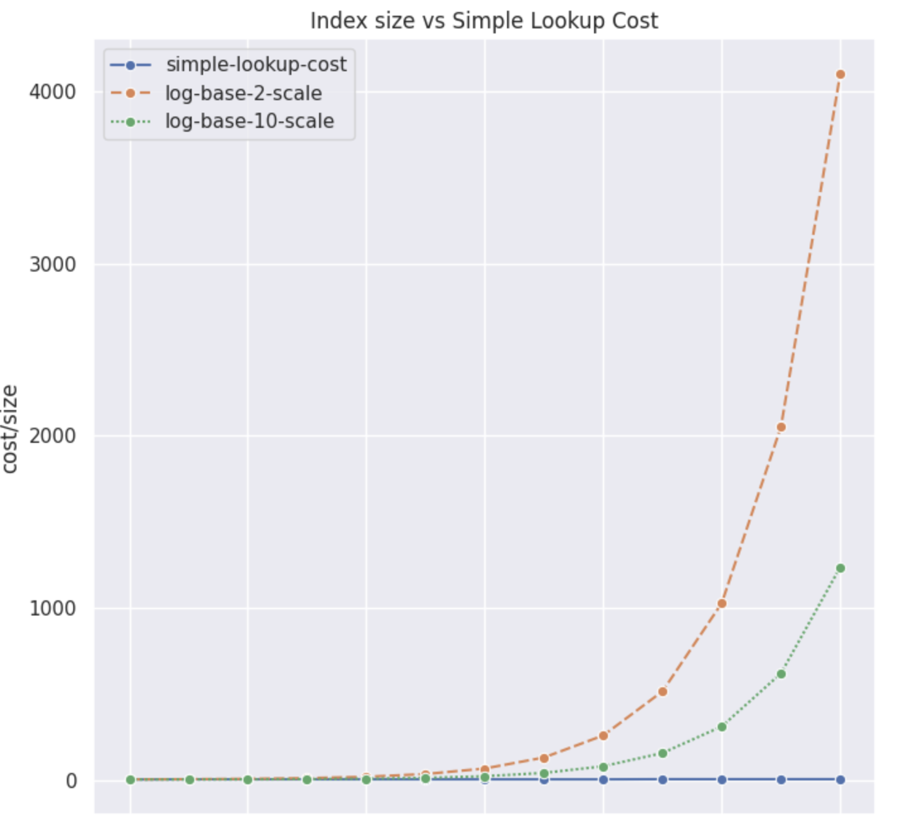

# Seaborn Exploring btree index efficienc

### Build raw dataframe out of log data and simple shell commands

```
btree-lsm-demo % cat btree-lsm-demo % cat lsm-tree-single-hot-row-problem.log
...
#postgres@6f5a3bbda7c2:~$ pgbench -P 1 -c 10  -t 100000 -f update-abalance-for-aid-1.sql
starting vacuum...end.
progress: 1.0 s, 1960.0 tps, lat 4.193 ms stddev 5.261
progress: 2.0 s, 2359.9 tps, lat 4.237 ms stddev 2.854
...
progress: 140.0 s, 2764.1 tps, lat 3.617 ms stddev 2.817
progress: 141.0 s, 2763.8 tps, lat 3.614 ms stddev 2.814
progress: 142.0 s, 2799.2 tps, lat 3.572 ms stddev 2.741
```

and

```
btree-lsm-demo % cat lsm-tree-single-hot-row-problem.log | grep ^progress | cut -f4 -d' ' | awk   '{print  NR ":" $1 ", " } ' | tr -d '\n'
1:1960.0, 2:2359.9, 3:1990.0, 4:1754.9, 5:1535.1, 6:1434.0, 7:1318.9, 8:1108.1, 9:1254.0, 10:1266.0, 11:1226.0, 12:1160.0, 13:1111.9, 14:1097.1, 15:1042.0, 16:1039.0, 17:977.0, 18:626.9, 19:141.0, 20:132.0, 21:136.0, 22:131.0, 23:128.0, 24:125.0, 25:122.0, 26:118.0, 27:114.0, 28:114.0, 29:112.0, 30:111.0, 31:109.0, 32:208.0, 33:217.0, 34:219.0, 35:213.0, 36:217.0, 37:216.9, 38:216.0, 39:217.0, 40:218.0, 41:218.0, 42:214.0, 43:220.0, 44:217.0, 45:216.0, 46:218.0, 47:216.0, 48:215.0, 49:172.0, 50:216.0, 51:217.0, 52:207.0, 53:191.0, 54:215.0, 55:209.0, 56:214.0, 57:217.0, 58:215.0, 59:215.0, 60:216.0, 61:216.0, 62:214.0, 63:217.0, 64:217.0, 65:212.0, 66:215.0, 67:216.0, 68:216.0, 69:213.0, 70:217.0, 71:213.0, 72:216.0, 73:215.0, 74:216.0, 75:208.0, 76:214.0, 77:211.0, 78:214.0, 79:210.0, 80:212.0, 81:208.0, 82:211.0, 83:207.0, 84:210.0, 85:208.0, 86:205.0, 87:208.0, 88:206.0, 89:210.0, 90:209.0, 91:211.0, 92:212.0, 93:210.0, 94:1567.0, 95:2668.8, 96:2758.1, 97:2761.0, 98:2635.1, 99:2735.9, 100:2740.0, 101:2748.1, 102:2757.9, 103:2674.1, 104:2714.0, 105:2663.7, 106:2605.9, 107:2754.2, 108:2473.9, 109:2094.1, 110:2686.9, 111:2697.3, 112:2761.0, 113:2753.1, 114:2749.8, 115:2713.2, 116:2746.8, 117:2678.0, 118:2681.1, 119:2752.0, 120:2741.9, 121:2796.0, 122:2802.0, 123:2801.9, 124:2774.1, 125:2661.0, 126:2764.2, 127:2473.9, 128:2671.8, 129:2785.1, 130:2765.9, 131:2788.0, 132:2806.3, 133:2807.9, 134:2797.9, 135:2732.8, 136:2784.2, 137:2687.2, 138:2712.1, 139:2782.7, 140:2764.1, 141:2763.8, 142:2799.2
```


### Convert raw dataframe into a chart


From within my jupyter notebook:
```
!pip install matplotlib scikit-learn pandas seaborn

d = { 'simple-lookup-cost': [   3,   4,    4,    4,    4,    4,     4,     4,     4,     5,    5,  5    ], 
       'log-base-2-scale':  [3.00, 4.00, 5.00, 6.00, 7.00, 8.00, 9.00, 10.00, 11.00, 12.00, 13.00, 14.00],
       'log-base-10-scale': [3.00, 3.30, 3.60, 3.90, 4.20, 4.51, 4.81,  5.11,  5.41,  5.71,  6.01, 6.31 ] } 

df = pd.DataFrame(data=d)
plt.figure(figsize=(8,8)) # Width and Height of the chart
sns.lineplot(data=df, marker='o', ) # Style used to mark the join between 2 points
plt.xlabel('scale-factor (to the power of 2)') # x-axis name
plt.ylabel('order-of-cost ') # y-axis name
plt.title('Exploring index efficiency') # Add a title
plt.show() # Display the graph~ 
```


generates



